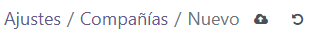

# UT03 - Implantación de un ERP en la empresa
## PR0301 - Facturas con Odoo

Primero de todo, creamos una nueva empresa. Para eso, navegaremos a ajustes, buscaremos la seccion de compañia y pulsaremos el botón de nuevo.

Una vez dentro, solo tenemos que rellenar la información y darle al botón.

De la misma manera, accedemos a la seccion de usuarios dentro de ajustes, y creamos uno nuevo.

Rellenamos la informacion del usuario, dandole acceso al usuario al modulo de facturacion, pero no como administrador, y por lo tanto, no le damos ajustes de administracion.

Para poder iniciar sesion con este usuario, debemos asignarle una contraseña ya que no tiene una por defecto.

Una vez creado el usuario, vamos a modificar la configuracion de la factura. Para ello, vamos a ir a la seccion de diseño del documento dentro de los ajustes generales.

Navegamos hacia la seccion del correo electrónico, donde podemos editar los colores del encabezado y el botón.

Buscamos la seccion de facturacion, donde encontramos las opciones para añadir el logo y la imagen de fondo.

Después, dentro de la sección de ajustes de facturacion encontramos la opción de pagos de clientes, y dentro de esta la de códigos QR.

Para poder importar todos los clientes, debemos navegar a la sección de clientes, dentro de la cual estará la opción de favoritos. En favoritos, elegimos la opción de importar registros, la cual nos permitirá importar un archivo CSV.

Al importar, intentará asociar automaticamente los campos existentes en el CSV a los que existen predeterminados en Odoo. Como en este caso no coinciden, hay que asignarlos manualmente.

En este caso, la información está duplicada en los parametros de localidad y ciudad, por lo que Odoo lo reconoce y nos avisa.

Una vez importados los usuarios, cerramos la sesión como administrador y entramos como el usuario que habiamos creado previamente.
Al entrar en la sección de facturas, podemos comprobar que ahora no tenemos acceso a la configuración, y unicamente podemos interacturar con el sistema de crear facturas.

Tras darle al boton de crear factura, simplemente rellenamos los campos necesarios y le damos a confirmar.

Ahora podemos ver como esta factura ha sido añadida a la lista.

[Factura generada](./factura.pdf)