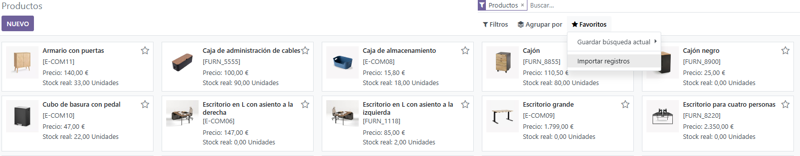
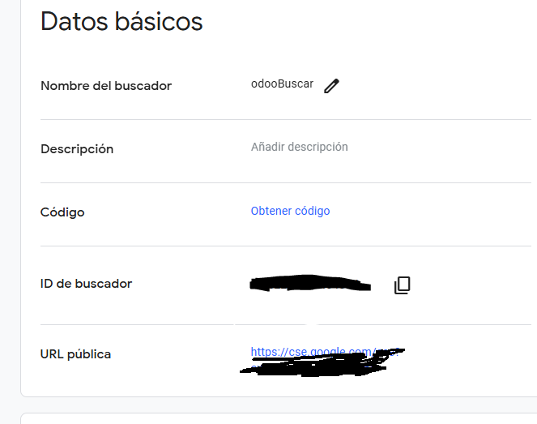

# UT03 - Implantación de un ERP en la empresa
## PR0302 - Inventario y Google Imágenes

Para poder hacer uso de la funcionalidad del inventario, primero tenemos que activar el módulo de inventario, el cual se sincronizará automaticamente con aquellos con los esté relacionado, como el facturas.

Una vez creado el inventario, vamos a rellenarlo. Se podria hacer a mano, producto a producto, pero en este caso contamos con un archivo CSV que contiene toda la información de los productos.
Al igual que los usuarios y clientes, podemos importar esta información para crear los productos automaticamente.
Navegamos a la lista de productos, y en la sección de favoritos, importamos.

Una vez importado, ya tenemos disponibles los productos en nuestro inventario. En este caso, hemos importado el nombre y el código de barras, que serán los campos necesarios para sincronizarlos con la busqueda de imágenes de Google.

Para poder hacer esto, primero tenemos que crearnos una cuenta de Google, y acceder a los servicios en la nube (Google Cloud). Dentro de estos, creamos un nuevo proyecto del tipo Custom Search. 

La utilización de estos servicios quiere de identificación. Esta identificación tiene lugar mediante una clave API, la cual tenemos que crear en el apartado de crear credenciales.

Una vez poseemos esta llave, debemos buscar el servicio de "Custom Search API" dentro de todos los disponibles, y habilitarlo.

Ahora que ya disponemos del servicio de custom search, tenemos que crear un nuevo buscador con Google, el cual enlazaremos con nuestro Odoo.

Nos aseguramos de buscar en toda la web (a menos que queramos utilizar alguna página en concreto), y de utilizar la búsqueda de imagenes.

Esto nos genera un buscador con un enlace asociado. Sin embargo, nosotros necesitamos la ID del buscador para conectarla con Odoo, asi que clicamos en el boton de personalizar.

Ya hemos configurado todo lo necesario con Google, ahora solo queda sincronizar Google con Odoo.
Entramos en los ajustes de inventario, y buscamos la seccion de integraciones, donde tendria que estar la configuración de google imágenes.

Tras activar la funcionalidad, nos va a pedir la API para realizar las peticiones, y la ID del buscador que vamos a utilizar. Ya hemos obtenido estos dos valores en los pasos anteriores.

Ahora que ya está todo actualizado y configurado, vamos a comprobar si se actualizan las imagenes de algunos libros.

Las imagenes se obtienen automaticamente desde el servicio de Google y se actualizan en Odoo de manera correcta.

---
[Volver a la Unidad 3](../)
