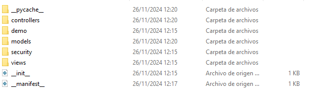

# UT05 - Entorno de desarrollo y primer módulo Odoo
## PR0501 - Primer módulo en Odoo

Una vez hemos instalado Odoo, podemos empezar a desarrollar módulos. Para facilitar este desarrollo, Odoo nos proporciona un comando scaffold, el cual nos genera la estructura básica de un módulo.

El primer fichero que debemos configurar es el manifest. Este contiene los metadatos del módulo, tales como su nombre y descripción. Es muy importante configurar el valor depends, el cual contiene una lista con el nombre de todos los módulos de los cuales depende, y en data 

 
# En construccion

---
[Volver a la Unidad 5](../)