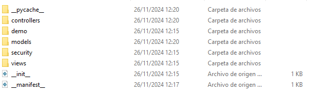
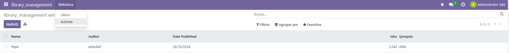
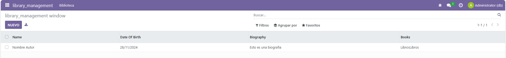

# UT05 - Entorno de desarrollo y primer módulo Odoo
## PR0502 - Modulo con dos modelos

El principio del desarrollo es similar al de la practica anterior, y será el que usaremos para definir la estructura inicial de todos los módulos que creemos en Odoo. Para ello, utilizamos el método scaffold para generar la estructura inicial.


A destacar en diferencia con el ejemplo anterior, vamos a utilizar dos modelos diferentes, ya que ahora tenemos dos tipos de "objetos" diferentes, autores y libros, con atributos distintos.

Comenzamos por el archivo manifest.py, donde definimos la información principal del módulo. A diferencia de la práctica anterior, vemos como tenemos múltiples archivos en views.

```xml
# -*- coding: utf-8 -*-
{
    'name': "library_management",

    'summary': """
        Short (1 phrase/line) summary of the module's purpose, used as
        subtitle on modules listing or apps.openerp.com""",

    'description': """
        Long description of module's purpose
    """,

    'author': "Juan Gutierrez",
    'website': "https://www.yourcompany.com",

    # Categories can be used to filter modules in modules listing
    # Check https://github.com/odoo/odoo/blob/16.0/odoo/addons/base/data/ir_module_category_data.xml
    # for the full list
    'category': 'Uncategorized',
    'version': '0.1',

    # any module necessary for this one to work correctly
    'depends': ['base'],

    # always loaded
    'data': [
        'security/ir.model.access.csv',
        'views/library_author_views.xml',
        'views/library_book_views.xml',
        'views/library_menu_views.xml',
    ],
    # only loaded in demonstration mode
    'demo': [
        'demo/demo.xml',
    ],
}
```

Esto se debe a que vamos a utilizar una nueva forma de organizarnos: Un fichero view por cada vista, y un fichero view a mayores para los menus.

El fichero library_menu_views.xml define los menuItems y funcionan igual que en el caso anterior, con un menuItem padre, y unos menuItem al fondo relacionados con acciones. Es importante tener en cuenta que son dos acciones diferentes.

```xml
<odoo>
  <data>
    <!-- Top menu item -->

    <menuitem name="library_management" id="library_management.menu_root"/>
    <!-- menu categories -->

    <menuitem name="Biblioteca" id="library_management.menu_1" parent="library_management.menu_root"/>

    <!-- actions -->

    <menuitem name="Libros" id="library_management.menu_books" parent="library_management.menu_1"
              action="library_management.action_window_books"/>
    <menuitem name="Autores" id="library_management.menu_authors" parent="library_management.menu_1"
              action="library_management.action_window_authors"/>

  </data>
</odoo>
```

Para ver las acciones tendriamos que ir a ficheros separados, pues hemos separado cada vista en un fichero. Como además cada vista referencia a un modelo diferente, vamos a ver los módulos por separado.

Por una parte, tenemos los libros. Estos se encuentran representados en un fichero library_book.py.

```python
# -*- coding: utf-8 -*-

from odoo import models, fields, api


class library_book(models.Model):
    _name = 'library_management.library_book'
    _description = 'library_management.library_book'

    name = fields.Char()
    author = fields.Char()
    date_published = fields.Date()
    isbn = fields.Integer()
    synopsis = fields.Text()
```

A este modelo apuntan una accion y una vista, ambas contenidas en un fichero library_book_views.xml.

```xml
<odoo>
  <data>
    <!-- explicit list view definition -->

    <record model="ir.ui.view" id="library_management.list_books">
      <field name="name">library_management list</field>
      <field name="model">library_management.library_book</field>
      <field name="arch" type="xml">
        <tree>
          <field name="name"/>
          <field name="author"/>
          <field name="date_published"/>
          <field name="isbn"/>
          <field name="synopsis"/>
        </tree>
      </field>
    </record>


    <!-- actions opening views on models -->

    <record model="ir.actions.act_window" id="library_management.action_window_books">
      <field name="name">Libros</field>
      <field name="res_model">library_management.library_book</field>
      <field name="view_mode">tree,form</field>
    </record>

  </data>
</odoo>
```

De la misma manera, tenemos un modelo para los autores, library_author.py.

```python
# -*- coding: utf-8 -*-

from odoo import models, fields, api


class library_author(models.Model):
    _name = 'library_management.library_author'
    _description = 'library_management.library_author'

    name = fields.Char()
    date_of_birth = fields.Date()
    biography = fields.Text()
    books = fields.Text()
```

El cual tiene una accion y una vista asociados.

```xml
<odoo>
  <data>
    <!-- explicit list view definition -->

    <record model="ir.ui.view" id="library_management.list_authors">
      <field name="name">library_management list</field>
      <field name="model">library_management.library_author</field>
      <field name="arch" type="xml">
        <tree>
          <field name="name"/>
          <field name="date_of_birth"/>
          <field name="biography"/>
          <field name="books"/>
        </tree>
      </field>
    </record>


    <!-- actions opening views on models -->

    <record model="ir.actions.act_window" id="library_management.action_window_authors">
      <field name="name">Autores</field>
      <field name="res_model">library_management.library_author</field>
      <field name="view_mode">tree,form</field>
    </record>

  </data>
</odoo>
```

Un detalle importante es que al crear nuevos archivos, tenemos que referenciar estos archivos internamente para que Odoo pueda utilizarlos. Para las vistas, ya hemos comprobado que se realiza en el manifest. Sin embargo, para los modelos, hay que hacerlo en el archivo init.py, incluido dentro de la carpeta models.
```python
# -*- coding: utf-8 -*-

from . import library_author
from . import library_book
```

De la misma manera que la práctica anterior, ahora que tenemos todas las dependencias creadas, debemos darle los permisos de seguridad a cada modelo para que sean visibles. En este caso, como tenemos dos modelos, creamos dos reglas.

```python
id,name,model_id:id,group_id:id,perm_read,perm_write,perm_create,perm_unlink
access_library_management_library_author,library_management.library_author,model_library_management_library_author,base.group_user,1,1,1,1
access_library_management_library_book,library_management.library_book,model_library_management_library_book,base.group_user,1,1,1,1
```

Con esto, ya hemos definido todo lo que necesitabamos para nuestro módulo, y funciona correctamente.





---
[Volver a la Unidad 5](../)