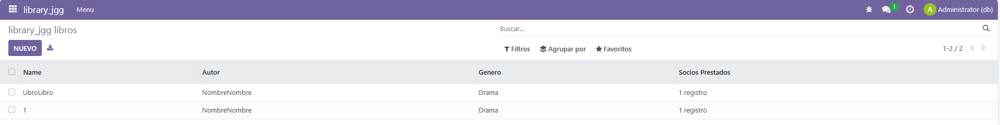
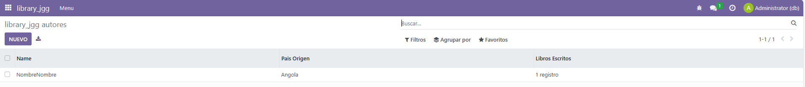
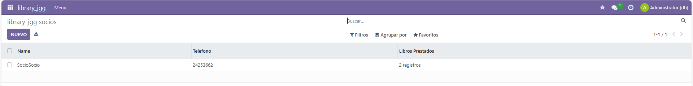

# UT06 - Desarrollo de módulos de Odoo: Modelo y vista
## PR0602 - Campos relacionales

### manifest
```xml
# -*- coding: utf-8 -*-
{
    'name': "library_jgg",

    'summary': """
        Short (1 phrase/line) summary of the module's purpose, used as
        subtitle on modules listing or apps.openerp.com""",

    'description': """
        Long description of module's purpose
    """,

    'author': "My Company",
    'website': "https://www.yourcompany.com",

    # Categories can be used to filter modules in modules listing
    # Check https://github.com/odoo/odoo/blob/16.0/odoo/addons/base/data/ir_module_category_data.xml
    # for the full list
    'category': 'Uncategorized',
    'version': '0.1',

    # any module necessary for this one to work correctly
    'depends': ['base'],

    # always loaded
    'data': [
        'security/ir.model.access.csv',
        'views/views.xml',
        'views/templates.xml',
    ],
    # only loaded in demonstration mode
    'demo': [
        'demo/demo.xml',
    ],
}

```


### views
```xml
<odoo>
  <data>
    <!-- explicit list view definition -->

    <record model="ir.ui.view" id="library_jgg.vista_libros">
      <field name="name">library_jgg libros</field>
      <field name="model">library_jgg.libros</field>
      <field name="arch" type="xml">
        <tree>
          <field name="name"/>
          <field name="autor"/>
          <field name="genero"/>
          <field name="socios_prestados"/>
        </tree>
      </field>
    </record>

    <record model="ir.ui.view" id="library_jgg.vista_autores">
      <field name="name">library_jgg autores</field>
      <field name="model">library_jgg.autores</field>
      <field name="arch" type="xml">
        <tree>
          <field name="name"/>
          <field name="pais_origen"/>
          <field name="libros_escritos"/>
        </tree>
      </field>
    </record>

    <record model="ir.ui.view" id="library_jgg.vista_socios">
      <field name="name">library_jgg socios</field>
      <field name="model">library_jgg.socios</field>
      <field name="arch" type="xml">
        <tree>
          <field name="name"/>
          <field name="telefono"/>
          <field name="libros_prestados"/>
        </tree>
      </field>
    </record>
    <!-- actions opening views on models -->

    <record model="ir.actions.act_window" id="library_jgg.action_libros">
      <field name="name">library_jgg libros</field>
      <field name="res_model">library_jgg.libros</field>
      <field name="view_mode">tree,form</field>
    </record>

    <record model="ir.actions.act_window" id="library_jgg.action_autores">
      <field name="name">library_jgg autores</field>
      <field name="res_model">library_jgg.autores</field>
      <field name="view_mode">tree,form</field>
    </record>

    <record model="ir.actions.act_window" id="library_jgg.action_socios">
      <field name="name">library_jgg socios</field>
      <field name="res_model">library_jgg.socios</field>
      <field name="view_mode">tree,form</field>
    </record>
    <!-- Top menu item -->

    <menuitem name="library_jgg" id="library_jgg.menu_root"/>

    <!-- menu categories -->

    <menuitem name="Menu" id="library_jgg.menu_1" parent="library_jgg.menu_root"/>

    <!-- actions -->

    <menuitem name="Libros" id="library_jgg.menu_libros" parent="library_jgg.menu_1"
              action="library_jgg.action_libros"/>
    <menuitem name="Autores" id="library_jgg.menu_autores" parent="library_jgg.menu_1"
              action="library_jgg.action_autores"/>
    <menuitem name="Socios" id="library_jgg.menu_socios" parent="library_jgg.menu_1"
              action="library_jgg.action_socios"/>

  </data>
</odoo>
```


### models
```python
# -*- coding: utf-8 -*-

from odoo import models, fields, api


class libros(models.Model):
    _name = 'library_jgg.libros'
    _description = 'library_jgg.libros'

    name = fields.Char()
    autor = fields.Many2one(comodel_name='library_jgg.autores')
    genero = fields.Selection(selection = [
        ('novela', 'Novela'),
        ('drama', 'Drama'),
        ('cf', 'Ciencia Ficcion'),
        ('misterio', 'Misterio'),
        ('terror', 'Terror'),
        ('historico', 'Historico')
    ])
    socios_prestados = fields.Many2many('library_jgg.socios')


class autores(models.Model):
    _name = 'library_jgg.autores'
    _description = 'library_jgg.autores'

    name = fields.Char()
    pais_origen = fields.Many2one('res.country')
    libros_escritos = fields.One2many(comodel_name='library_jgg.libros', inverse_name='name')


class socios(models.Model):
    _name = 'library_jgg.socios'
    _description = 'library_jgg.socios'

    name = fields.Char()
    telefono = fields.Char()
    libros_prestados = fields.Many2many('library_jgg.libros')


```
 

### security
```python
id,name,model_id:id,group_id:id,perm_read,perm_write,perm_create,perm_unlink
access_library_jgg_autores,library_jgg.libros,model_library_jgg_libros,base.group_user,1,1,1,1
access_library_jgg_libros,library_jgg.autores,model_library_jgg_autores,base.group_user,1,1,1,1
access_library_jgg_socios,library_jgg.socios,model_library_jgg_socios,base.group_user,1,1,1,1
```


 
 
 

---
[Volver a la Unidad 6](../)