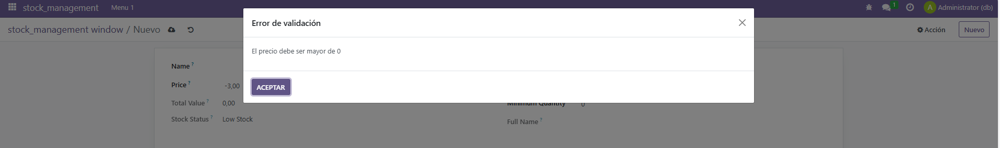
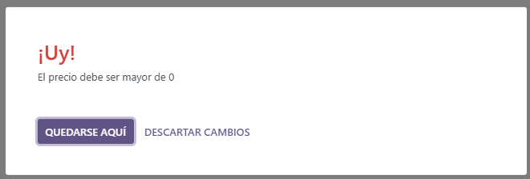
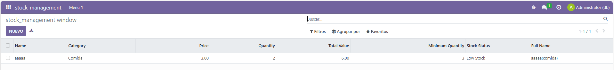

# UT06 - Desarrollo de módulos de Odoo: Modelo y vista
## PR0603 - Campos calculados y restricciones


### manifest
```xml
# -*- coding: utf-8 -*-
{
    'name': "stock_management",

    'summary': """
        Short (1 phrase/line) summary of the module's purpose, used as
        subtitle on modules listing or apps.openerp.com""",

    'description': """
        Long description of module's purpose
    """,

    'author': "My Company",
    'website': "https://www.yourcompany.com",

    # Categories can be used to filter modules in modules listing
    # Check https://github.com/odoo/odoo/blob/16.0/odoo/addons/base/data/ir_module_category_data.xml
    # for the full list
    'category': 'Uncategorized',
    'version': '0.1',

    # any module necessary for this one to work correctly
    'depends': ['base'],

    # always loaded
    'data': [
        'security/ir.model.access.csv',
        'views/views.xml',
        'views/templates.xml',
    ],
    # only loaded in demonstration mode
    'demo': [
        'demo/demo.xml',
    ],
}

```
 

### views
```xml
<odoo>
  <data>
    <!-- explicit list view definition -->

    <record model="ir.ui.view" id="stock_management.list">
      <field name="name">stock_management list</field>
      <field name="model">stock_management.product</field>
      <field name="arch" type="xml">
        <tree>
          <field name="name"/>
          <field name="category"/>
          <field name="price"/>
          <field name="quantity"/>
          <field name="total_value"/>
          <field name="minimum_quantity"/>
          <field name="stock_status"/>
          <field name="full_name"/>
        </tree>
      </field>
    </record>


    <!-- actions opening views on models -->

    <record model="ir.actions.act_window" id="stock_management.action_window">
      <field name="name">stock_management window</field>
      <field name="res_model">stock_management.product</field>
      <field name="view_mode">tree,form</field>
    </record>


    <!-- server action to the one above -->
<!--
    <record model="ir.actions.server" id="stock_management.action_server">
      <field name="name">stock_management server</field>
      <field name="model_id" ref="model_stock_management_stock_management"/>
      <field name="state">code</field>
      <field name="code">
        action = {
          "type": "ir.actions.act_window",
          "view_mode": "tree,form",
          "res_model": model._name,
        }
      </field>
    </record>
-->

    <!-- Top menu item -->

    <menuitem name="stock_management" id="stock_management.menu_root"/>

    <!-- menu categories -->

    <menuitem name="Menu 1" id="stock_management.menu_1" parent="stock_management.menu_root"/>

    <!-- actions -->

    <menuitem name="List" id="stock_management.menu_1_list" parent="stock_management.menu_1"
              action="stock_management.action_window"/>

  </data>
</odoo>
```

### models
```python
# -*- coding: utf-8 -*-

from odoo import models, fields, api
from odoo.exceptions import ValidationError

class product(models.Model):
    _name = 'stock_management.product'
    _description = 'stock_management.product'
    _sql_constraints = [
        ('longitud_nombre', 'CHECK(LENGTH(name)>=3)', 'El nombre debe contener por lo menos 3 caracteres'),
        ('nombre_unico', 'unique(name)','El nombre del producto debe ser unico'),
        ('cantidad_stock_positiva', 'CHECK(quantity>=0)', 'El stock no puede bajar por debajo de 0'),
        ('nombre_y_categoria_unicos', 'unique(name, category)','La combinacion del nombre y la categoria deben ser unicos')
    ]

    name = fields.Char()
    category = fields.Selection(selection = [
        ('comida', 'Comida'),
        ('ropa', 'Ropa'),
        ('tecnologia', 'Tecnologia')])
    price = fields.Float()
    quantity = fields.Integer()
    total_value = fields.Float(compute = "_calcular_precio_total")
    minimum_quantity = fields.Integer()
    stock_status = fields.Selection(selection=[
        ('normal', 'Cantidad normal'),
        ('low', 'Low Stock')
    ], compute="_calcular_estado_stock"
    )
    full_name = fields.Char(compute="_calcular_nombre_completo")


    @api.depends('price', 'quantity')
    def _calcular_precio_total(self):
        for producto in self:
            producto.total_value = producto.price * producto.quantity

    @api.depends('quantity', 'minimum_quantity')
    def _calcular_estado_stock(self):
        for producto in self:
            producto.stock_status = 'normal' if producto.quantity > producto.minimum_quantity else 'low'
    
    @api.depends('name', 'category')
    def _calcular_nombre_completo(self):
        for producto in self:
            if producto.name is not False and producto.category is not False:
                producto.full_name = producto.name + '(' + producto.category + ')'
            else:
                producto.full_name = ""

    @api.constrains('price')
    def _comprobar_precio_positivo(self):
        for producto in self:
            if producto.price <= 0:
                raise ValidationError('El precio debe ser mayor de 0')
    
    @api.constrains('quantity')
    def _comprobar_cantidad_positiva(self):
        for producto in self:
            if producto.quantity < 0:
                raise ValidationError('La cantidad debe ser mayor o igual que 0')
            
    @api.constrains('total_value')
    def _comprobar_maximo_valor_total(self):
        for producto in self:
            if producto.total_value > 100000:
                raise ValidationError('El valor total no puede superar los 10000') 

    @api.constrains('category')
    def _comprobar_existe_categoria(self):
        for producto in self:
            if producto.category is None:
                raise ValidationError('El producto debe contener una categoria')
```


### security
```xml
id,name,model_id:id,group_id:id,perm_read,perm_write,perm_create,perm_unlink
access_stock_management_stock_management,stock_management.stock_management,model_stock_management_product,base.group_user,1,1,1,1
```


 
 
 

---
[Volver a la Unidad 6](../)