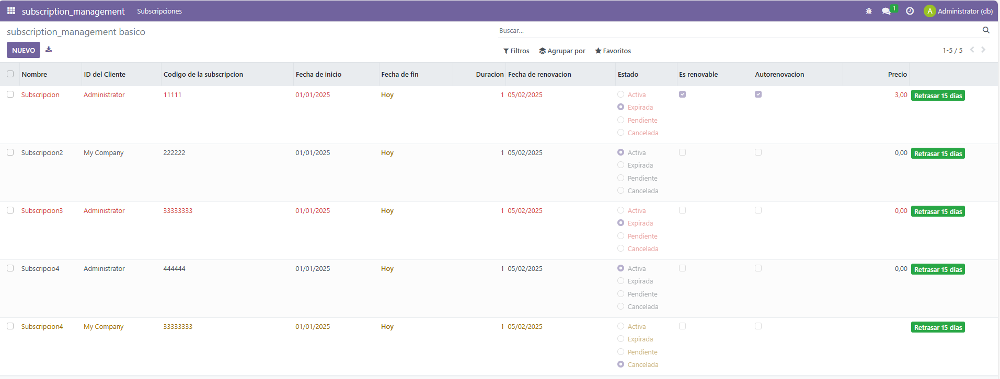

# UT06 - Desarrollo de módulos de Odoo: Modelo y vista
## PR0604 - Vista de tipo lista

### manifest
```xml
# -*- coding: utf-8 -*-
{
    'name': "subscription_management",

    'summary': """
        Short (1 phrase/line) summary of the module's purpose, used as
        subtitle on modules listing or apps.openerp.com""",

    'description': """
        Long description of module's purpose
    """,

    'author': "My Company",
    'website': "https://www.yourcompany.com",

    # Categories can be used to filter modules in modules listing
    # Check https://github.com/odoo/odoo/blob/16.0/odoo/addons/base/data/ir_module_category_data.xml
    # for the full list
    'category': 'Uncategorized',
    'version': '0.1',

    # any module necessary for this one to work correctly
    'depends': ['base'],

    # always loaded
    'data': [
        'security/ir.model.access.csv',
        'views/templates.xml',
        'views/static_web.xml',
        'views/vista_web_dinamica.xml',
        'views/vista_formulario.xml',
        'views/views.xml'
    ],
    # only loaded in demonstration mode
    'demo': [
        'demo/demo.xml',
    ],
}

```
 
### models

```python
# -*- coding: utf-8 -*-

from odoo import models, fields, api
from datetime import datetime

class subscription(models.Model):
    _name = 'subscription_management.subscription'
    _description = 'subscription_management.subscription'

    name = fields.Char(required=True)
    customer_id = fields.Many2one(required=True, comodel_name='res.partner')
    subscription_code = fields.Char(required=True)
    start_date = fields.Date(required=True)
    end_date = fields.Date()
    duration_months = fields.Integer(compute="_calcular_duracion_meses")
    renewal_date = fields.Date()
    status = fields.Selection(selection=[
        ('active', 'Activa'),
        ('expired', 'Expirada'),
        ('pending', 'Pendiente'),
        ('cancelled', 'Cancelada')
    ])
    is_renewable = fields.Boolean()
    auto_renewal = fields.Boolean()
    price = fields.Float()
    usage_limit = fields.Integer()
    current_usage = fields.Integer()
    use_percent = fields.Float(compute="_calcular_porcentaje_uso")

    @api.depends('start_date', 'end_date')
    def _calcular_duracion_meses(self):
        for subscription in self:
            if subscription.start_date and subscription.end_date:
                subscription.duration_months = abs((subscription.end_date - subscription.start_date).days)/30
            else:
                subscription.duration_months = -1

    @api.depends('usage_limit', 'current_usage')
    def _calcular_porcentaje_uso(self):
        for subscription in self:
            if subscription.usage_limit and subscription.current_usage:
                subscription.use_percent = subscription.current_usage / subscription.usage_limit * 100
            else:
                subscription.use_percent = -1
    
    def retrasar_fecha_fin(self):
        self.end_date = fields.Date.add(self.end_date, days=15)
```

### views

```xml
<odoo>
  <data>
    <!-- explicit list view definition -->

    <record model="ir.ui.view" id="subscription_management.vista_basico">
      <field name="name">subscription_management list</field>
      <field name="model">subscription_management.subscription</field>
      <field name="arch" type="xml">
        <tree
          decoration-danger="status=='expired'"
          decoration-warning="status=='cancelled'"
          limit="15"
        >
          <field name="name" string="Nombre"/>
          <field name="customer_id" string="ID del Cliente"/>
          <field name="subscription_code" string="Codigo de la subscripcion"/>
          <field name="start_date" string="Fecha de inicio"/>
          <field name="end_date" string="Fecha de fin" widget="remaining_days"/>
          <field name="duration_months" string="Duracion"
          attrs="{'invisible': [('duration_months', '==', -1)]}"/>
          <field name="renewal_date" string="Fecha de renovacion"/>
          <field name="status" string="Estado" widget="radio"/>
          <field name="is_renewable" string="Es renovable"/>
          <field name="auto_renewal" string="Autorenovacion"/>
          <field name="price" string="Precio"
          attrs="{'invisible': [('status', '==', 'cancelled')]}"/>
          <button name="retrasar_fecha_fin"
                  type="object"
                  string="Retrasar 15 dias"
                  class="btn-success"
                  attrs="{'invisible': [('duration_months', '==', -1)]}"/>
        </tree>
      </field>
    </record>

    <record model="ir.ui.view" id="subscription_management.vista_uso">
      <field name="name">subscription_management list</field>
      <field name="model">subscription_management.subscription</field>
      <field name="arch" type="xml">
        <tree
        limit="15">
          <field name="name" string="Nombre"/>
          <field name="usage_limit" string="Limite de uso"/>
          <field name="current_usage" string="Uso actual"/>
          <field name="use_percent" string="Porcentaje de uso"
          decoration-danger="use_percent>80" widget="progressbar" avg="1"/>
        </tree>
      </field>
    </record>

    <!-- actions opening views on models -->

    <record model="ir.actions.act_window" id="subscription_management.action_basico">
      <field name="name">subscription_management basico</field>
      <field name="res_model">subscription_management.subscription</field>
      <field name="view_mode">tree,form</field>
      <field name="view_id" ref="subscription_management.vista_basico"/>
    </record>

    <record model="ir.actions.act_window" id="subscription_management.action_uso">
      <field name="name">subscription_management uso</field>
      <field name="res_model">subscription_management.subscription</field>
      <field name="view_mode">tree,form</field>
      <field name="view_id" ref="subscription_management.vista_uso"/>
    </record>

    <record model="ir.actions.act_window" id="subscription_management.accion_vista_formulario">
      <field name="name">subscription_management uso</field>
      <field name="res_model">subscription_management.subscription</field>
      <field name="view_mode">tree,form</field>
      <field name="view_id" ref="subscription_management.vista_formulario"/>
    </record>

    <!-- Top menu item -->

    <menuitem name="subscription_management" id="subscription_management.menu_root"/>

    <!-- menu categories -->

    <menuitem name="Subscripciones" id="subscription_management.menu_1" parent="subscription_management.menu_root"/>

    <!-- actions -->

    <menuitem name="Datos basicos" id="subscription_management.menu_basico" parent="subscription_management.menu_1"
              action="subscription_management.action_basico"/>
    <menuitem name="Datos de uso" id="subscription_management.menu_uso" parent="subscription_management.menu_1"
              action="subscription_management.action_uso"/>
    <menuitem name="Formulario" id="subscription_management.menu_formulario" parent="subscription_management.menu_1"
              action="subscription_management.accion_vista_formulario"/>          

  </data>
</odoo>
```

### security

```python
id,name,model_id:id,group_id:id,perm_read,perm_write,perm_create,perm_unlink
access_subscription_management_subscription_management,subscription_management.subscription_management,model_subscription_management_subscription,base.group_user,1,1,1,1
```

 

---
[Volver a la Unidad 6](../)