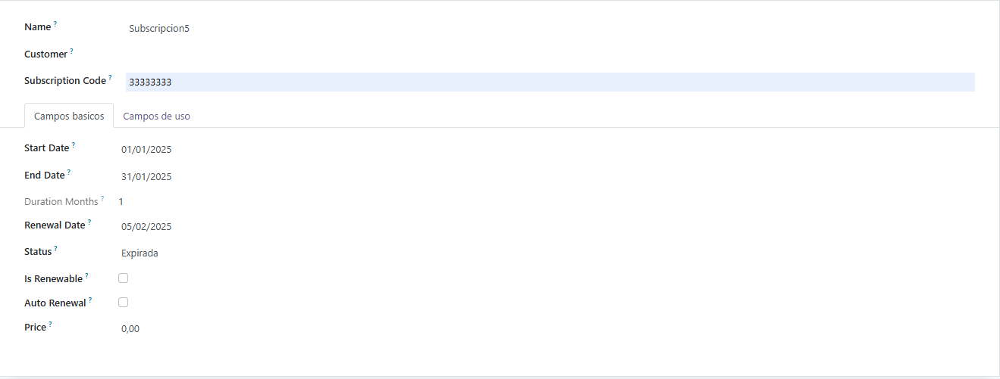
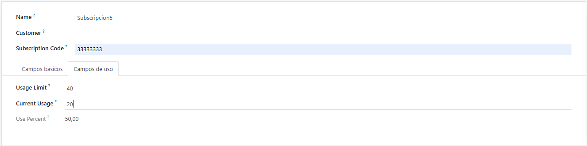

# UT06 - Desarrollo de módulos de Odoo: Modelo y vista
## PR0605 - Vistas de tipo formulario


### vista formulario
```xml
<odoo>
    <data>
        <record model="ir.ui.view" id="subscription_management.vista_formulario">
        <field name="name">subscription_management form</field>
        <field name="model">subscription_management.subscription</field>
        <field name="arch" type="xml">
            <form>
                <sheet>
                    <group>
                        <field name="name" />
                        <field name="customer_id"/>
                        <field name="subscription_code"/>
                    </group>

                    <notebook>
                    <page string="Campos basicos">
                        <group>
                        <field name="start_date" />
                        <field name="end_date" />
                        <field name="duration_months" />
                        <field name="renewal_date" />
                        <field name="status" />
                        <field name="is_renewable" />
                        <field name="auto_renewal" />
                        <field name="price" />
                        </group>
                    </page>

                    <page string="Campos de uso">
                        <group>
                            <field name="usage_limit"/>
                            <field name="current_usage" />
                            <field name="use_percent" />
                        </group>
                    </page>
                    </notebook>
                </sheet>
            </form>
            </field>
        </record>
    </data>
</odoo>
```

 
 
 

---
[Volver a la Unidad 6](../)