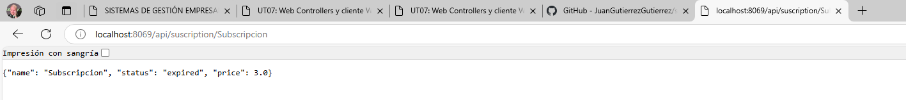
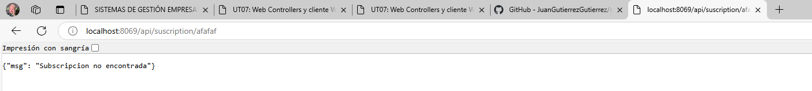

# UT07 - Desarrollo de módulos de Odoo: Web Controllers y cliente Web
## PR0702 - API REST


### controllers

```python
# -*- coding: utf-8 -*-
from odoo import http
from odoo.http import request, Response
import json

class ControladorEstatico(http.Controller):
    @http.route('/subscription/static', type='http', auth='public', website=True)
    def pagina_principal(self, **kwargs):
        return request.render('subscription_management.static_web', {})
    
    @http.route('/subscription/all', type='http', auth='public', website=True)
    def pagina_dinamica(self, **kwargs):
        subscriptions = request.env['subscription_management.subscription'].search([])
        return http.request.render('subscription_management.vista_web_dinamica',{
            'subscriptions' : subscriptions
        }

        )

    @http.route("/api/suscription", type="http", methods=['GET'], csrf=False)
    def get_todas_subs(self, **kwargs):
        try:
            subs = request.env['subscription_management.subscription'].sudo().search([])
            result = []
            for sub in subs:
                result.append({
                    'name' : sub.name,
                    'status' : sub.status,
                    'price' : sub.price
                })
            response = Response(
                json.dumps(result),
                content_type = 'application/json',
                status = 200
            )
            return response
        except Exception as e:
            return Response(
                json.dumps(
                    {"error" : f"{str(e)}"} 
                ),
                content_type="application/json",
                status=500
            )


    @http.route("/api/suscription/<string:name>", type="http", methods=['GET'], csrf=False)
    def get_sub_por_nombre(self, name):
        try:
            subs = request.env['subscription_management.subscription'].sudo().search([('name', '=', name)], limit=1)
            if not subs:
                return Response(
                    json.dumps({'msg': 'Subscripcion no encontrada'}),
                    content_type="application/json",
                    status=404
                )
            
            result = {
                'name' : subs.name,
                'status' : subs.status,
                'price' : subs.price
            }            
            response = Response(
                json.dumps(result),
                content_type = 'application/json',
                status = 200
            )
            return response
        except Exception as e:
            return Response(
                json.dumps(
                    {"error" : f"{str(e)}"} 
                ),
                content_type="application/json",
                status=500
            )
```


 
 

---
[Volver a la Unidad 7](../)